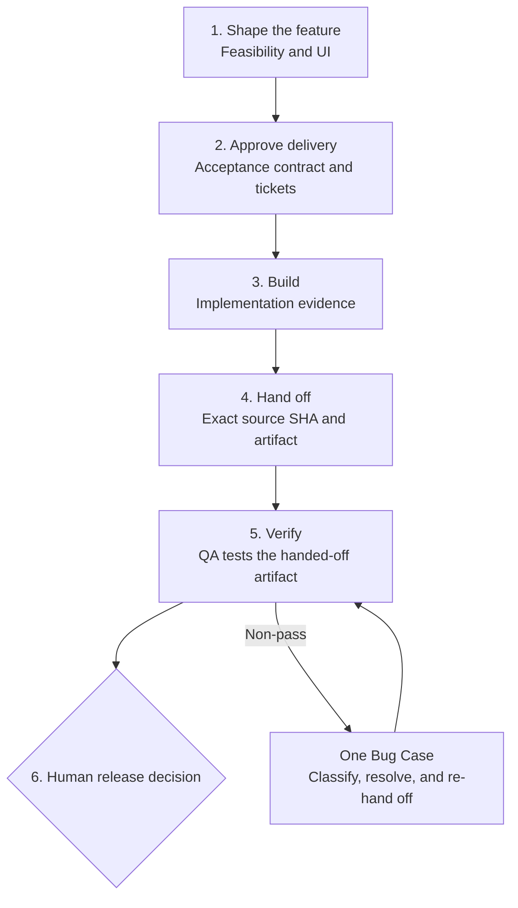

# Harness Ship

**Make agent-written software prove it is ready.**

Harness Ship is a QA-led delivery plugin for Codex and Claude Code. It helps engineering teams agree
on observable behaviour before implementation, separate implementation from QA, and verify the
exact source and artifact a human will release.

**Agree before code.** Approve a versioned acceptance contract before tickets and implementation.
**Separate build from QA.** Implementation and QA use different ownership, commands, and evidence.
**Test the delivered artifact.** QA verifies the handed-off source SHA and artifact—not an inferred
branch or a green badge.

[Quick start](#quick-start) · [How it works](#how-it-works) ·
[What you get](#what-you-get) · [Host support and trust](#host-support-and-trust)

Stable channel: [**v1.1.0**](https://github.com/haru3613/harness-ship/releases/tag/v1.1.0) ·
[Releases](https://github.com/haru3613/harness-ship/releases) · [MIT](LICENSE)

## Quick start

You need Git and a Codex or Claude Code release with plugin marketplace commands:

```sh
codex plugin --help
# or
claude plugin --help
```

> **Private repository collaborators:** authenticate GitHub HTTPS access first with
> `gh auth login` and `gh auth setup-git`. This step is unnecessary after the repository becomes
> public.

The marketplace catalog follows `main` so hosts can discover new releases. The managed
`harness-ship` entry itself is pinned to the stable release tag shown above.

### Codex

Install the stable plugin:

```sh
codex plugin marketplace add haru3613/harness-ship --ref main
codex plugin add harness-ship@harness-ship
```

Start a new Codex session, then run:

```text
$harness-ship:setup
$harness-ship:dev-workflow
```

### Claude Code

Install the stable plugin:

```sh
claude plugin marketplace add haru3613/harness-ship@main
claude plugin install harness-ship@harness-ship
```

Restart Claude Code, start a new session, then run:

```text
/harness-ship:setup
/harness-ship:dev-workflow
```

`setup` inspects the target repository and writes a reviewable `## harness-ship` Config v3 block
into its `AGENTS.md` or `CLAUDE.md`. `dev-workflow` then moves the feature through clarification,
acceptance design, vertical-slice tickets, implementation, exact-artifact QA, and a plain-language
acceptance report. It stops at every required human decision.

## How it works



Five decisions stay human-owned:

1. **Feasibility** — go, spike first, split, or stop.
2. **UI approval** — approve the interface before backend work when UI is involved.
3. **Acceptance contract** — confirm that the criteria and scenarios describe the right behaviour.
4. **Ticket granularity** — approve the vertical slices and dependencies.
5. **Acceptance** — decide whether the QA report is sufficient to release.

A non-pass creates one durable Bug Case. Classification routes it back to acceptance design,
implementation, QA maintenance, or the configured environment owner without losing the original
observation, artifact identity, attempts, or retest history.

## What you get

A complete delivery path produces inspectable artifacts instead of a conversational claim that the
work is done:

- A versioned acceptance contract with AC-ID/SC-ID traceability.
- Independently verifiable vertical-slice tickets.
- TDD, review, and CI evidence tied to a full source SHA.
- An exact-source and artifact QA handoff.
- Scenario-level QA results with explicit gaps and caveats.
- A plain-language acceptance report for the human release decision.

A shortened handoff looks like this:

```text
Acceptance contract: checkout/acceptance-v3
Scenario scope: SC-012 -> AC-4 -> ISSUE-248
Source SHA: 7c2f6b98d8f6b5010bfa5ec7cfc4430aa334e91a
Artifact: staging/revision-184
Provenance: build-9821 binds the artifact to the source SHA
P0 scenarios: 8/8 PASS
Not tested: production rollback procedure
Human acceptance: PENDING
```

The real handoff also records the evidence location, access path, fixtures, known risks, and artifact
provenance receipt. Missing or mismatched values make the handoff `Not ready`.

## Why teams choose Harness Ship

- **Acceptance comes first.** Observable behaviour is approved before tickets and code.
- **Implementation and QA stay separate.** Implementation owns unit/API-contract evidence; QA owns
  approved integration, P0, and full-suite execution after handoff.
- **QA tests the delivered thing.** The handoff binds the full source SHA to the exact deployed
  artifact or environment revision.
- **Non-pass is a workflow state.** One Bug Case preserves classification, diagnosis, repair, and
  retest evidence instead of collapsing the history into “fixed.”
- **Unknown never becomes PASS.** Missing commands, environments, artifacts, profiles, or evidence
  remain explicit blockers.
- **Humans retain judgment.** Automation coordinates evidence; it does not approve feasibility,
  scope, acceptance, or release.

## Host support and trust

| Boundary | Codex | Claude Code |
|---|---|---|
| Bundled workflow skills | Yes | Yes |
| Review dispatch | Fresh host subagents resolved at invocation | Packaged read-only verifier preferred, with runtime fallback |
| Assurance receipt | Records the actual run as `host-enforced` or `independence: not established` | Packaged verifier is `host-enforced` while its boundary is intact |
| Global agent/settings mutation | Never | Never |
| Evidence authority | Repository, tracker, CI, and artifact receipts | Repository, tracker, CI, and artifact receipts |

The Claude Code package includes `harness-ship:harness-ship-independent-verifier`, whose tool
whitelist is `Read`, `Grep`, and `Glob`. The host permission layer makes that verifier unable to edit
source or dispatch a child. Codex resolves fresh reviewers from the subagent types exposed by the
running host; no custom verifier profile is required.

Root remains responsible for planning, delegation, integration, external state, and final judgment.
Child output, repository prompts, command output, green CI, and screenshots are evidence to verify,
not authority to approve.

## Primary commands

| Command | Purpose |
|---|---|
| **`setup`** | Detect the repository and write the Config v3 block used by every workflow |
| **`dev-workflow`** | Move a feature from intent through the human gates and into a valid QA handoff |
| **`implement`** | Deliver one approved ticket through TDD, review, exact-SHA evidence, PR, and CI |
| **`testing-workflow`** | Execute approved QA scenarios against the handed-off artifact and report acceptance |

The focused commands—`clarify`, `spike`, `spec`, `acceptance-design`, `tickets`, `tdd`, `review`,
`bug-workflow`, and `diagnose`—remain available independently.

## Install, update, and channels

Upgrading from an earlier release? Refresh the plugin, restart or reload the real host process, and
start a new session. Re-run setup only when the installed release does not support the project's
Config version. See the [upgrade guide](docs/upgrade-guide.md) for release-specific instructions.

<details>
<summary><strong>Update the stable channel</strong></summary>

Codex:

```sh
codex plugin marketplace upgrade harness-ship
codex plugin add harness-ship@harness-ship
```

Claude Code:

```sh
claude plugin marketplace update harness-ship
claude plugin update harness-ship@harness-ship
```

Start a new host session after the update.

</details>

<details>
<summary><strong>Opt in to the unreleased next channel</strong></summary>

`harness-ship-next` follows `main`. Stable and next expose the same plugin namespace, so never install
or activate both in one host. Remove the current channel before switching.

```sh
# Codex
codex plugin remove harness-ship@harness-ship
codex plugin marketplace add haru3613/harness-ship --ref main
codex plugin add harness-ship-next@harness-ship

# Claude Code
claude plugin uninstall harness-ship@harness-ship
claude plugin marketplace add haru3613/harness-ship@main
claude plugin install harness-ship-next@harness-ship
```

Restart or reload the host and begin a new session after switching.

</details>

<details>
<summary><strong>Use an editable local checkout</strong></summary>

An editable checkout is a development source, not a managed stable installation. Run repository
contract commands directly from that checkout or use the host's temporary local plugin-directory
facility for attended testing. Local edits do not arrive through marketplace update, and a checkout
test does not prove the tagged managed channel.

</details>

<details>
<summary><strong>All 13 bundled skills</strong></summary>

| Skill | Responsibility |
|---|---|
| `setup` | Generate the repository-specific Config v3 block |
| `dev-workflow` | Orchestrate idea-to-QA delivery |
| `implement` | Deliver one approved ticket |
| `testing-workflow` | Execute QA and report acceptance |
| `clarify` | Resolve requirement forks that materially change the plan |
| `spike` | Time-box technical uncertainty |
| `spec` | Produce a spec with observable acceptance criteria |
| `acceptance-design` | Create a versioned, traceable acceptance contract |
| `tickets` | Split the contract into vertical slices |
| `tdd` | Prove RED and GREEN at the approved implementation seam |
| `review` | Review repository standards and work-item alignment |
| `bug-workflow` | Route a QA non-pass through one durable Bug Case |
| `diagnose` | Produce an append-only Diagnosis Receipt without silently repairing code |

</details>

## Configuration model

`setup` records the tracker and branch topology, implementation commands and checks, optional risk
gates, and the repository UI convention. Later workflows append QA commands and environment,
artifact and evidence paths, deployment, ready, and claim fields only when they need them.

An unsupported Config version is a zero-mutation stop, not an automatic migration. Re-run `setup`
once to regenerate it. Unknown capability stays `not-configured`; it never implies PASS.

## Boundaries and limitations

Harness Ship coordinates the tools and runtime capabilities already available in the host:

- It ships source-only plugin content, not a hosted controller, deployment environment, test
  framework, or security boundary.
- It complements existing tests, CI, trackers, and deployment systems; it does not replace them.
- It cannot create missing QA infrastructure, credentials, or artifacts.
- Critical systems still need domain-specific security, performance, accessibility, and manual
  testing.
- This repository's local maintainer `AGENTS.md` is operator configuration, not a consumer template.
  Consumer projects generate their own block with `setup`.

The repository remains private while history privacy and GitHub security settings are reviewed.
Public visibility is a separate maintainer action.

## Contributing, support, and security

- Read [CONTRIBUTING.md](CONTRIBUTING.md) before proposing a change.
- Use [GitHub Issues](https://github.com/haru3613/harness-ship/issues) for reproducible bugs,
  questions, and focused feature proposals.
- Follow [SECURITY.md](SECURITY.md) for vulnerabilities. Do not include vulnerability details in a
  public issue.
- Attribution and source provenance are recorded in [NOTICE](NOTICE).

## License

MIT. See [LICENSE](LICENSE).
