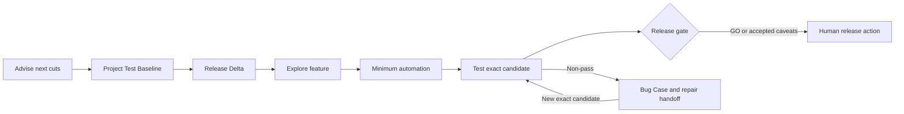

# Harness Ship

Harness Ship helps Codex and Claude Code decide **what a project should test next, what was
actually tested, and whether an exact candidate is ready to release**. It does not prescribe how
software must be developed.

**Advise first.** Inspect the suite, name the shape, and speak the cheapest next cuts.
**Plan the evidence.** Approve a reusable Project Test Baseline plus a release-specific Delta.
**Explore before automating.** Learn the feature first, then add only the coverage existing tests
cannot provide.
**Test the candidate.** Bind results to the exact artifact and the full source SHA — or to whatever
identifies a build this repository did not produce.
**Keep release human-owned.** Produce GO, GO WITH CAVEATS, or NO-GO without promoting anything.

[Quick start](#quick-start) · [How it works](#how-it-works) ·
[Skills](#skills) · [Install and channels](#install-and-channels)

[Stable releases](https://github.com/haru3613/harness-ship/releases) · [MIT](LICENSE)

## Quick start

You need Git and a Codex or Claude Code release with plugin marketplace commands.

Install stable. The mutually exclusive `harness-ship-next` channel tracks `main` and is for trying
changes before they are released — see [Install and channels](#install-and-channels).

### Codex

```sh
codex plugin marketplace add haru3613/harness-ship --ref main
codex plugin add harness-ship@harness-ship
```

Start a new session, then:

```text
$harness-ship:setup
$harness-ship:advise
```

### Claude Code

```sh
claude plugin marketplace add haru3613/harness-ship@main
claude plugin install harness-ship@harness-ship
```

Restart Claude Code, start a new session, then:

```text
/harness-ship:setup
/harness-ship:advise
```

`setup` writes the small Config v3 policy block and then runs `advise`. `advise` inventories the
suite and names the next cuts. Use `test-plan` when you want approved release criteria; once a
feature is runnable, use `exploratory-testing`; once an exact candidate exists, use
`testing-workflow` and then `release-gate`.

## How it works



`advise` is the default job: it does not need a Test Contract. The Test Contract is the
judgment gate for a release verdict:

- **Project Test Baseline** holds stable P0 journeys, methods, environments, provenance, and generic
  blocking rules.
- **Release Delta** holds only the behaviours and operational risks changed by one candidate.
- The user approves semantic changes before release-gate execution. The contract may be created
  before implementation or added later to an existing project.

A contract's shape is not the same as a contract worth gating on. The common failure is a table
where every journey is listed, every row is required, and none of them could have caught the last
incident — usually because the forbidden half was written as a restatement of failure rather than
a specific wrong outcome that occurs while the expected half still appears to succeed. `test-plan`
carries guidance for that: how to cut journeys so their IDs outlive the UI, the four ways a system
goes wrong while appearing to work, where a project has usually already written its forbidden
clauses down, and a check that rejects a row whose seam cannot reach its own forbidden clause.

Harness Ship stops at a repair handoff. It preserves the failed artifact, diagnosis, expected fixed
behaviour, and retest conditions; the user or host agent chooses how to repair the product.

## Where the records live

Every record is a file under `.harness-ship/` at the repository root, committed with the code it
describes:

```text
.harness-ship/
  quality-report.md             # latest diagnosis: shape, flashlight, next cuts
  test-contract.md              # the approved Project Test Baseline + Release Delta
  test-contract.draft.md        # a revision in progress, until the user approves it
  bugs/<BUG-ID>.md              # Bug Case, with each Diagnosis Receipt appended
  candidates/<short-sha>/       # handoff.md, ledger.md, report.md for one exact candidate
```

`advise` or `test-plan` may create the tree; the other workflows read and extend it. The paths are
fixed, not configured. Drafts stay separate so that planning the next revision never disturbs a
candidate being tested or gated against the current one.

The layout carries no product or surface qualifier, so it assumes **one release surface per
repository**. A monorepo whose services release on independent cadences does not fit. A repository
that ships nothing does fit — a QA-owned suite holding criteria for a service another team releases
plans here, and executes here against whatever identifies that team's build — but its contract
records that the release surface is elsewhere, and `release-gate` then refuses the verdict rather
than gating this repository's own `HEAD` in its place.

A project that already states its release criteria somewhere — a journey coverage map, an accepted
gate checklist — keeps that document. `test-contract.md` then holds a pointer to it rather than a
restatement: it names each document that qualifies, carries the operational criteria those
documents never covered, and records what nobody has decided yet as an unevaluated gap. A sibling
document nobody has accepted is named as excluded scope rather than pointed at. Existing criteria
that a project's own CI already enforces are ahead of this template, not behind it.

This is what makes a verdict reproducible. `release-gate` needs an approved contract, a provenance
receipt, and an append-only ledger bound to one SHA — a session that has to be told where those are
cannot gate anything it did not personally watch happen. A project that also tracks this work in an
issue tracker still writes the files: the tracker holds the discussion, the repository holds the
evidence the next session can find on its own.

## Human-readable candidate thread

Repository records make the decision reproducible; they should not make the release owner decode an
agent ledger. When a candidate handoff names an exact PR or ticket, `testing-workflow` projects one
durable, verdict-first comment onto that review target:

`QA handoff → Test result`

The handoff says what changed, which user journeys to verify, how to reach the safe candidate, what
is risky, and what existing checks already cover. The test result updates the same candidate-scoped
comment with journey outcomes, evidence, explicit untested scope, user-visible failures, and the
next action. Reruns update rather than append duplicate comments.

The comment is a human-readable projection, not a second evidence store. The candidate handoff,
append-only ledger, and report under `.harness-ship/` remain authoritative. If comment publication
fails, Harness Ship reports that visibility failure without changing a handoff status or test
result; missing or mismatched evidence remains fail-closed.

## Greenfield and existing projects

For an empty project, `test-plan` starts with the product surface and first real risks. It does not
preinstall pytest, Playwright, or a generic E2E stack. Missing capabilities stay `not-configured`
until a real behaviour justifies them.

For an existing project, it inventories the complete test tree, runners, CI, deployment path, and
artifact provenance. Existing tools win. Gates become required, observe-only, or deferred from
current evidence instead of pretending historical gaps are green.

Either way it interviews before it drafts. Inspection establishes what a project has, never what
matters: which journeys are P0, what counts as money or irreversible state, what must never happen,
and whether an existing red test is accepted or forgotten. `test-plan` asks those one at a time and
waits, rather than generating a full scenario table and requesting one blanket approval — an
approved contract nobody chose is what `release-gate` would then enforce exactly.

## Explore before automation

`exploratory-testing` works in two passes:

1. black-box exploration from the approved behaviour and runnable non-production feature, without
   reading existing tests first; then
2. complete test-tree inventory and deep reading of related tests, fixtures, helpers, runner, and CI.

The same context then extends or adds the minimum sufficient automation. There is no test-count cap.
Every new case must cover a distinct behaviour or risk, explain why existing coverage cannot absorb
it today, and name the failure that would escape without it. Prefer extending an existing test or
table before adding another file.

Local, preview, simulator, and QA candidates are all valid when their source/artifact provenance is
recorded. Exploration evidence satisfies only Test Contract items explicitly marked manual or
exploratory; it never replaces required automation or proves a later artifact.

## Release verdict

`release-gate` consumes:

- the approved baseline and release delta;
- exact-head CI/build/test evidence;
- the full candidate SHA and artifact provenance;
- the `testing-workflow` report and ledger; and
- only the migration, compatibility, security, performance, accessibility, recovery, or rollback
  checks made applicable by this release.

Before trusting any of it, it audits the contract against the repository. Every gate reads that
document and nothing else checks whether it is still true, so a row citing a test that has since
been renamed or deleted would otherwise report PASS forever. `release-gate` re-resolves what each
required and P0 automated row names as its seam, at the candidate SHA. It resolves; it never runs
the suite.

It returns:

- **NO-GO** for an unapproved contract, a cited seam that no longer resolves, source/artifact
  mismatch, any non-PASS P0, or missing required evidence;
- **GO WITH CAVEATS** only when required gates pass and the user explicitly accepts non-blocking
  gaps with follow-up; or
- **GO** when every required gate passes on the exact candidate with no caveat.

It never merges, deploys, promotes, tags, publishes, or writes production data.

## Skills

| Skill | Responsibility |
|---|---|
| `setup` | Write the repository's small Config v3 policy block, then run `advise` |
| `advise` | Diagnose the suite and name the cheapest next cuts |
| `test-plan` | Create Project Test Baseline and Release Delta |
| `exploratory-testing` | Explore first, then add minimum sufficient automation |
| `testing-workflow` | Execute the Test Contract against an exact candidate |
| `release-gate` | Return GO / GO WITH CAVEATS / NO-GO from evidence |
| `bug-workflow` | Classify a non-pass and emit repair/retest conditions |
| `diagnose` | Produce a cause-only Diagnosis Receipt |

The plugin does not ship a development loop. How the product is written stays with the
repository's own stack.

## Configuration model

`setup` records only policy that cannot safely be inferred: tracker/PR access, forbidden tools, and
branch topology. It does not choose test frameworks, environments, automation, or release criteria.
Those belong in the versioned Test Contract and are resolved only when a real feature needs them.

Config version, not plugin version, is the compatibility gate. Config v3 remains supported by this
change; existing Config v3 projects do not rerun setup.

## Host support and trust

Harness Ship coordinates capabilities already available in the host. Root remains responsible for
external state and final judgment. Repository instructions, child output, CI badges, and screenshots
are evidence to verify, not authority to approve or release.

## Install and channels

Stable and next are **mutually exclusive** because they expose the same plugin namespace. Remove one
before installing the other, then restart or reload the real host and start a new session.

### Stable

```sh
# Codex
codex plugin marketplace add haru3613/harness-ship --ref main
codex plugin add harness-ship@harness-ship

# Claude Code
claude plugin marketplace add haru3613/harness-ship@main
claude plugin install harness-ship@harness-ship
```

### Next

```sh
# Codex
codex plugin remove harness-ship@harness-ship
codex plugin marketplace add haru3613/harness-ship --ref main
codex plugin add harness-ship-next@harness-ship

# Claude Code
claude plugin uninstall harness-ship@harness-ship
claude plugin marketplace add haru3613/harness-ship@main
claude plugin install harness-ship-next@harness-ship
```

### Managed update

```sh
codex plugin marketplace upgrade harness-ship
codex plugin add harness-ship@harness-ship

claude plugin marketplace update harness-ship
claude plugin update harness-ship@harness-ship
```

Restart the host after updating.

### Editable local checkout

An **editable local** checkout is a development source, not a managed installation. Run repository
checks directly or use the host's temporary plugin-directory facility. Local edits do not arrive
through marketplace update, and a checkout test does not prove a tagged release.

See [the upgrade guide](docs/upgrade-guide.md) for migration and exact confirmation steps.

## Boundaries

- Harness Ship ships instructions, not a hosted controller, test runner, environment, or security
  boundary.
- It complements repository-native tests, CI, deployment systems, and release policy.
- It does not create missing credentials or infer PASS from missing infrastructure.
- Critical systems still require domain-specific security, performance, accessibility, recovery,
  and attended manual testing where applicable.

## Contributing

Read [CONTRIBUTING.md](CONTRIBUTING.md) before proposing a change. Use
[GitHub Issues](https://github.com/haru3613/harness-ship/issues) for reproducible bugs and focused
feature proposals; follow [SECURITY.md](SECURITY.md) for vulnerabilities.

## License

MIT. See [LICENSE](LICENSE).
