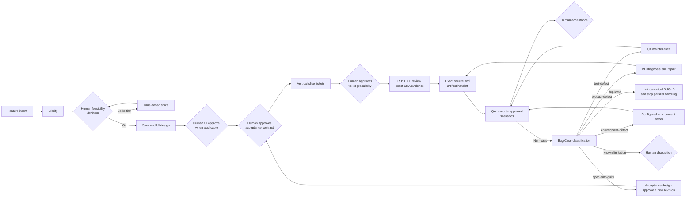

# Harness Ship

**QA-led software delivery for Codex and Claude Code.**

Turn feature intent into an approved acceptance contract, evidence-backed implementation,
exact-artifact QA, and a human release decision.

> Harness Ship is a workflow plugin, not a test framework, autonomous controller, hosted service,
> or security boundary. It coordinates the tools and role profiles already available in your host.

Current release: **v0.7.0** · License: **MIT** · Repository status: **private pre-release review**

## Why Harness Ship

Agentic coding makes implementation faster, but speed does not solve the hardest delivery
questions:

- Did we agree on observable behaviour before code was written?
- Did RD prove the implementation at the right seam?
- Did QA test the exact artifact RD handed off?
- Can a failure travel through diagnosis, repair, and retest without losing traceability?
- Does a human still own the decisions that should not be automated?

Harness Ship makes those boundaries explicit.

| Common failure mode | Harness Ship response |
|---|---|
| Expected behaviour is discovered after implementation | A versioned acceptance contract is approved before tickets and code |
| The same agent writes, tests, and declares its own work complete | RD and QA have separate ownership, commands, and evidence |
| Green CI is treated as proof for an unknown build | Handoffs pin the full source SHA, artifact provenance, and evidence location |
| A failed test becomes an unstructured chat thread | One durable Bug Case routes diagnosis, repair, and QA retest |
| Automation silently invents missing capability | `not-configured` stays unknown and never becomes PASS |

## The delivery loop



Five decisions stay human-owned:

1. **Feasibility** — go, spike first, split, or stop.
2. **UI approval** — approve the interface before backend work when UI is involved.
3. **Acceptance contract** — confirm that spec criteria and scenarios describe the right behaviour.
4. **Ticket granularity** — confirm the vertical slices and dependencies.
5. **Acceptance** — decide whether the QA report is sufficient to release.

Everything between those decisions is automated as far as the configured evidence allows.

## What makes it QA-led

- **Acceptance before implementation.** `acceptance-design` turns the current stable spec into
  stable AC-ID/SC-ID-linked Given/When/Then scenarios before tickets are created.
- **RD and QA do different work.** RD owns unit/API-contract evidence, TDD, review, and the handoff.
  QA owns integration/P0/full-suite execution after that handoff.
- **QA tests the delivered thing.** Artifact provenance and the evidence location are part of the
  contract; QA does not infer what was tested from a branch name or a green badge.
- **Non-pass is a workflow state.** A Bug Case preserves observation, classification, attempts,
  repair receipts, and retest history instead of collapsing everything into “fixed.”
- **Missing evidence fails closed.** Unknown commands, profiles, environments, and artifacts remain
  explicit blockers.

## Quick start

### 1. Check the host

You need Git and a Codex or Claude Code release with plugin marketplace commands:

```sh
codex plugin --help
# or
claude plugin --help
```

This repository is currently private. Collaborators must authenticate GitHub HTTPS access first:

```sh
gh auth login       # skip when `gh auth status` is already green
gh auth setup-git
```

After the repository becomes public, this GitHub authentication step is no longer required.

### 2. Install

Codex:

```sh
codex plugin marketplace add haru3613/harness-ship --ref main
codex plugin add harness-ship@harness-ship
```

Claude Code:

```sh
claude plugin marketplace add haru3613/harness-ship@main
claude plugin install harness-ship@harness-ship
```

### 3. Start a new session and configure the target repository

Run `$harness-ship:setup` in Codex or `/harness-ship:setup` in Claude Code. Setup inspects the
target repository and writes a `## harness-ship` Config v2 block into its `AGENTS.md` or
`CLAUDE.md`.

Review that block before delivery work begins. Re-run setup after changing the stack, tracker,
branch model, test commands, QA environment, artifact path, or host role profiles.

### 4. Deliver and verify

Describe the feature or invoke `dev-workflow`. Harness Ship moves through clarification, spec,
acceptance design, ticketing, implementation, QA handoff, testing, Bug Case routing when needed,
and a plain-language acceptance report. It stops at each required human gate.

Canonical direct commands remain available:

- Codex: `$harness-ship:acceptance-design` and `$harness-ship:testing-workflow`
- Claude Code: `/harness-ship:acceptance-design` and `/harness-ship:testing-workflow`

## Install and update details

Upgrading from an earlier release? Both hosts must install the refreshed plugin, restart or reload
the real host process, start a new session, and re-run setup. Follow the
[upgrade guide](docs/upgrade-guide.md); a project whose block does not match the current Config
version is a fail-closed stop, not an automatic migration — re-run setup once to regenerate it.

### Stable, next, and editable source

The managed `harness-ship` channel is stable and pinned to release tag `v0.7.0`.
`harness-ship-next` is an explicit opt-in that follows `main`. Tag immutability is enforced by the
publication mismatch guard and channel + tag + full-SHA + version receipts; it is not assumed from
the tag name. The marketplace catalog itself is deliberately refreshed from `main`, so a later
stable entry such as `v0.7.1` can be discovered without replacing a frozen catalog registration.
Both channels use that same mutable catalog but expose the same underlying plugin namespace, so
never install or activate both in one host. Remove the current channel before switching, then
restart or reload the host and begin a new session.

Opt in to next only when you intend to test unreleased source:

```sh
# Codex: after removing/deactivating the stable channel
codex plugin marketplace add haru3613/harness-ship --ref main
codex plugin add harness-ship-next@harness-ship

# Claude Code: after uninstalling the stable channel
claude plugin marketplace add haru3613/harness-ship@main
claude plugin install harness-ship-next@harness-ship
```

An editable local checkout is a development source, not a managed stable installation. Run the
repository contract commands directly from that checkout, or use the host's temporary local
plugin-directory facility for attended testing. Local edits do not arrive through marketplace
upgrade, and a checkout test does not prove the tagged managed channel. Do not mutate global plugin
state during repository contract validation.

### Codex

Update an existing install:

```sh
codex plugin marketplace upgrade harness-ship
codex plugin add harness-ship@harness-ship
```

The marketplace upgrade refreshes the Git source; the second command activates the refreshed
plugin. Start a new Codex session afterward.

Codex installation supplies skills only; it does not supply an independent verifier. Preflight
therefore reports `independence: not established` and `implement`'s independent gate stays unmet —
you may proceed on an explicit decision, and every review carries that label. Nothing is configured
to make this so: the verifier is resolved from the running host, because that is the only thing that
determines which agent actually loads. Setup never creates or overwrites global agents or settings.

If installation reports `could not read Username for 'https://github.com'` while the repository is
private, run `gh auth setup-git`, verify that
`git ls-remote https://github.com/haru3613/harness-ship.git refs/heads/main` succeeds, and retry.

### Claude Code

Update an existing install:

```sh
claude plugin marketplace update harness-ship
claude plugin update harness-ship@harness-ship
```

The marketplace update refreshes the catalog; the plugin update installs the refreshed plugin.
Restart Claude Code afterward.

Install supplies the verifier capability as the scoped Claude plugin agent
`harness-ship:harness-ship-independent-verifier`. The preflight gate reads that agent definition at
check time and compares its tools, model and effort against the required boundary —
`assurance: host-enforced`. There is nothing to configure and nothing to keep in sync. Because the tool whitelist is `Read`, `Grep`, `Glob`, the permission
layer makes the boundary physical: the verifier cannot edit source and has no tool with which to
dispatch a child. Harness Ship never copies agents into `~/.claude/agents` and never overwrites
global agents or settings.

## The 13 bundled skills

One bootstrap skill and three orchestration skills, plus nine self-contained blocks, make 13
bundled skills. They share one evidence model but remain usable as focused commands.

| Skill | Stage | Responsibility |
|---|---|---|
| **`setup`** | Bootstrap | Detect the repository and write the Config v2 block every workflow reads |
| **`dev-workflow`** | Orchestrate | Move an idea through the four pre-QA human gates and into a valid QA handoff |
| **`implement`** | Orchestrate | Route one claimed ticket through TDD, review, exact-SHA evidence, and PR/CI delivery |
| **`testing-workflow`** | Orchestrate | Execute approved QA scenarios against the handed-off artifact and report acceptance |
| `clarify` | Design | Resolve only the requirement forks that materially change the plan |
| `spike` | Design | Time-box uncertainty and return a feasible, not feasible, or needs-more verdict |
| `spec` | Design | Produce a spec with observable acceptance criteria at the highest useful seam |
| `acceptance-design` | QA design | Turn the current stable spec into a versioned, traceable acceptance contract |
| `tickets` | Plan | Split the approved contract into independently verifiable vertical slices |
| `tdd` | Build | Prove RED and GREEN behaviour at the approved RD seam |
| `review` | Assure | Review Standards and Work Item/spec alignment against a fixed point |
| `bug-workflow` | Repair loop | Route a QA non-pass through one durable Bug Case |
| `diagnose` | Diagnose | Produce a safe append-only Diagnosis Receipt without silently repairing the product |

## What setup records

- **Tracker and branch topology** — issue/PR systems, integration branch, and protected release
  branch.
- **Versioned RD/QA commands** — RD unit/API-contract commands stay separate from QA
  integration/P0/full-suite commands.
- **QA evidence boundary** — QA environment, artifact provenance, and durable evidence location.
- **Role profiles** — live host definitions, model/effort, write scope, capabilities, MCP/plugin
  boundary, and no-spawn policy.
- **Ready and claim rules** — ticket eligibility, owner/session claim, recovery, and fencing.
- **Deployment path** — how QA obtains an exact-source deployment or artifact receipt.
- **Risk gates** — optional data-mutation checks and the repository UI convention.

**Config v1 migration to v2:** re-run `setup` once. Setup first produces a proposed migration plan
without applying it. Review the complete proposed block and exact diff, correct any unsafe or
unknown binding, then give an exact confirmation for that proposal. Only that confirmation permits
apply; changed input or a changed proposal requires another review and confirmation. The migration
preserves known values, separates RD unit/API-contract commands from QA
integration/P0/full-suite commands, and records the QA environment, artifact provenance, evidence
location, and role-boundary provenance. Unknown capability stays `not-configured`; it never implies
PASS.

## Host and trust boundaries

| Boundary | Codex | Claude Code |
|---|---|---|
| Bundled skills | Yes | Yes |
| Bundled independent verifier | No — `independence: not established` | Yes — scoped plugin agent, `host-enforced` |
| Global agent/settings mutation | Never | Never |
| Controller/runtime | Supplied by the host | Supplied by the host |
| Evidence authority | Live repository, tracker, CI, and artifact receipts | Live repository, tracker, CI, and artifact receipts |

Root owns planning, delegation, integration, external state, and final judgment. Child output,
repository prompts, command output, green CI, and screenshots are evidence to verify—not authority
to approve.

## Boundaries and limitations

- Harness Ship ships source-only plugin content. It does not run a hosted service or deployment
  environment.
- It complements your test frameworks, CI, tracker, and deployment system; it does not replace
  them.
- It cannot create missing QA infrastructure, credentials, artifacts, or safe host profiles.
- The workflow adds useful discipline to agentic delivery, but critical systems still need
  domain-specific security, performance, accessibility, and manual testing.
- This repository's local maintainer `AGENTS.md` is an operator configuration, not a consumer
  template. Consumer projects generate their own block with `setup`.

## Project status

Harness Ship is installable from Git and its source/plugin lifecycle is covered by contract tests.
The repository remains private while history privacy and GitHub security settings are reviewed.
Public visibility is a separate maintainer action.

See [Releases](https://github.com/haru3613/harness-ship/releases) for published versions.

## Contributing, support, and security

- Read [CONTRIBUTING.md](CONTRIBUTING.md) before proposing a change.
- Use [GitHub Issues](https://github.com/haru3613/harness-ship/issues) for reproducible bugs,
  questions, and focused feature proposals.
- Follow [SECURITY.md](SECURITY.md) for vulnerabilities. Do not include vulnerability details in a
  public issue.
- Attribution and source provenance are recorded in [NOTICE](NOTICE).

## License

MIT. See [LICENSE](LICENSE).
