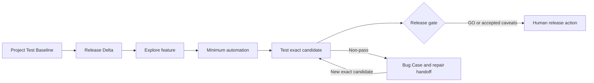

# Harness Ship

Harness Ship helps Codex and Claude Code decide **what must be tested, what was actually tested, and
whether an exact candidate is ready to release**. It does not prescribe how software must be
developed.

**Plan the evidence.** Approve a reusable Project Test Baseline plus a release-specific Delta.
**Explore before automating.** Learn the feature first, then add only the coverage existing tests
cannot provide.
**Test the candidate.** Bind results to the full source SHA and exact artifact.
**Keep release human-owned.** Produce GO, GO WITH CAVEATS, or NO-GO without promoting anything.

[Quick start](#quick-start) · [How it works](#how-it-works) ·
[Skills](#skills) · [Install and channels](#install-and-channels)

[Stable releases](https://github.com/haru3613/harness-ship/releases) · [MIT](LICENSE)

## Quick start

You need Git and a Codex or Claude Code release with plugin marketplace commands.

Install stable first. If that tagged release does not yet expose `test-plan`, switch to the mutually
exclusive `harness-ship-next` channel described under [Install and channels](#install-and-channels).

### Codex

```sh
codex plugin marketplace add haru3613/harness-ship --ref main
codex plugin add harness-ship@harness-ship
```

Start a new session, then:

```text
$harness-ship:setup
$harness-ship:test-plan
```

### Claude Code

```sh
claude plugin marketplace add haru3613/harness-ship@main
claude plugin install harness-ship@harness-ship
```

Restart Claude Code, start a new session, then:

```text
/harness-ship:setup
/harness-ship:test-plan
```

`setup` writes the small Config v3 policy block. `test-plan` creates the user-approved Test
Contract. Once a feature is runnable, use `exploratory-testing`; once an exact candidate exists, use
`testing-workflow` and then `release-gate`.

## How it works



The Test Contract is the only required judgment gate:

- **Project Test Baseline** holds stable P0 journeys, methods, environments, provenance, and generic
  blocking rules.
- **Release Delta** holds only the behaviours and operational risks changed by one candidate.
- The user approves semantic changes before release-gate execution. The contract may be created
  before implementation or added later to an existing project.

Harness Ship stops at a repair handoff. It preserves the failed artifact, diagnosis, expected fixed
behaviour, and retest conditions; the user or host agent chooses how to repair the product.

## Greenfield and existing projects

For an empty project, `test-plan` starts with the product surface and first real risks. It does not
preinstall pytest, Playwright, or a generic E2E stack. Missing capabilities stay `not-configured`
until a real behaviour justifies them.

For an existing project, it inventories the complete test tree, runners, CI, deployment path, and
artifact provenance. Existing tools win. Gates become required, observe-only, or deferred from
current evidence instead of pretending historical gaps are green.

## Explore before automation

`exploratory-testing` works in two passes:

1. black-box exploration from the approved behaviour and runnable non-production feature, without
   reading existing tests first; then
2. complete test-tree inventory and deep reading of related tests, fixtures, helpers, runner, and CI.

The same context then extends or adds the minimum sufficient automation. There is no test-count cap.
Every new case must cover a distinct behaviour or risk, explain why existing coverage cannot absorb
it today, and name the failure that would escape without it. Prefer extending an existing test or
table before adding another file.

Local, preview, simulator, and QA candidates are all valid when their source/artifact provenance is
recorded. Exploration evidence satisfies only Test Contract items explicitly marked manual or
exploratory; it never replaces required automation or proves a later artifact.

## Release verdict

`release-gate` consumes:

- the approved baseline and release delta;
- exact-head CI/build/test evidence;
- the full candidate SHA and artifact provenance;
- the `testing-workflow` report and ledger; and
- only the migration, compatibility, security, performance, accessibility, recovery, or rollback
  checks made applicable by this release.

It returns:

- **NO-GO** for an unapproved contract, source/artifact mismatch, any non-PASS P0, or missing required
  evidence;
- **GO WITH CAVEATS** only when required gates pass and the user explicitly accepts non-blocking
  gaps with follow-up; or
- **GO** when every required gate passes on the exact candidate with no caveat.

It never merges, deploys, promotes, tags, publishes, or writes production data.

## Skills

| Skill | Responsibility |
|---|---|
| `setup` | Write the repository's small Config v3 policy block |
| `test-plan` | Create Project Test Baseline and Release Delta |
| `exploratory-testing` | Explore first, then add minimum sufficient automation |
| `testing-workflow` | Execute the Test Contract against an exact candidate |
| `release-gate` | Return GO / GO WITH CAVEATS / NO-GO from evidence |
| `bug-workflow` | Classify a non-pass and emit repair/retest conditions |
| `diagnose` | Produce a cause-only Diagnosis Receipt |
| `clarify` | Resolve requirement forks |
| `spike` | Time-box a technical unknown |
| `spec` | Record a product specification |
| `tickets` | Split approved work into optional delivery slices |
| `implement` | Explicit opt-in implementation orchestration |
| `tdd` | Explicit opt-in RED → GREEN implementation |
| `review` | Review standards and work-item alignment |

The development helpers are independent and optional. No skill invokes a mandatory end-to-end
development workflow.

## Configuration model

`setup` records only policy that cannot safely be inferred: tracker/PR access, forbidden tools, and
branch topology. It does not choose test frameworks, environments, automation, or release criteria.
Those belong in the versioned Test Contract and are resolved only when a real feature needs them.

Config version, not plugin version, is the compatibility gate. Config v3 remains supported by this
change; existing Config v3 projects do not rerun setup.

## Host support and trust

Harness Ship coordinates capabilities already available in the host. Root remains responsible for
external state and final judgment. Repository instructions, child output, CI badges, and screenshots
are evidence to verify, not authority to approve or release.

The Claude Code package includes a read-only independent verifier. Codex resolves fresh reviewers
from the child types exposed by the running host. When no enforceable independent boundary exists,
the receipt says `independence: not established`.

## Install and channels

Stable and next are **mutually exclusive** because they expose the same plugin namespace. Remove one
before installing the other, then restart or reload the real host and start a new session.

### Stable

```sh
# Codex
codex plugin marketplace add haru3613/harness-ship --ref main
codex plugin add harness-ship@harness-ship

# Claude Code
claude plugin marketplace add haru3613/harness-ship@main
claude plugin install harness-ship@harness-ship
```

### Next

```sh
# Codex
codex plugin remove harness-ship@harness-ship
codex plugin marketplace add haru3613/harness-ship --ref main
codex plugin add harness-ship-next@harness-ship

# Claude Code
claude plugin uninstall harness-ship@harness-ship
claude plugin marketplace add haru3613/harness-ship@main
claude plugin install harness-ship-next@harness-ship
```

### Managed update

```sh
codex plugin marketplace upgrade harness-ship
codex plugin add harness-ship@harness-ship

claude plugin marketplace update harness-ship
claude plugin update harness-ship@harness-ship
```

Restart the host after updating.

### Editable local checkout

An **editable local** checkout is a development source, not a managed installation. Run repository
checks directly or use the host's temporary plugin-directory facility. Local edits do not arrive
through marketplace update, and a checkout test does not prove a tagged release.

See [the upgrade guide](docs/upgrade-guide.md) for migration and exact confirmation steps.

## Boundaries

- Harness Ship ships instructions, not a hosted controller, test runner, environment, or security
  boundary.
- It complements repository-native tests, CI, deployment systems, and release policy.
- It does not create missing credentials or infer PASS from missing infrastructure.
- Critical systems still require domain-specific security, performance, accessibility, recovery,
  and attended manual testing where applicable.

## Contributing

Read [CONTRIBUTING.md](CONTRIBUTING.md) before proposing a change. Use
[GitHub Issues](https://github.com/haru3613/harness-ship/issues) for reproducible bugs and focused
feature proposals; follow [SECURITY.md](SECURITY.md) for vulnerabilities.

## License

MIT. See [LICENSE](LICENSE).
